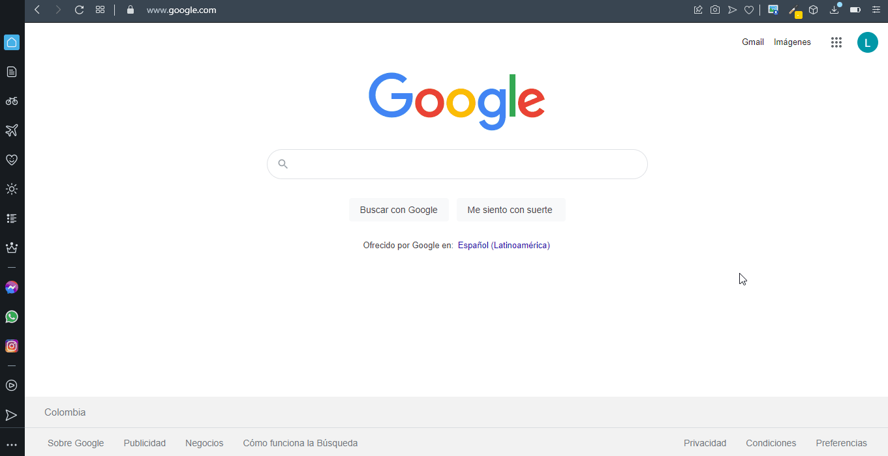
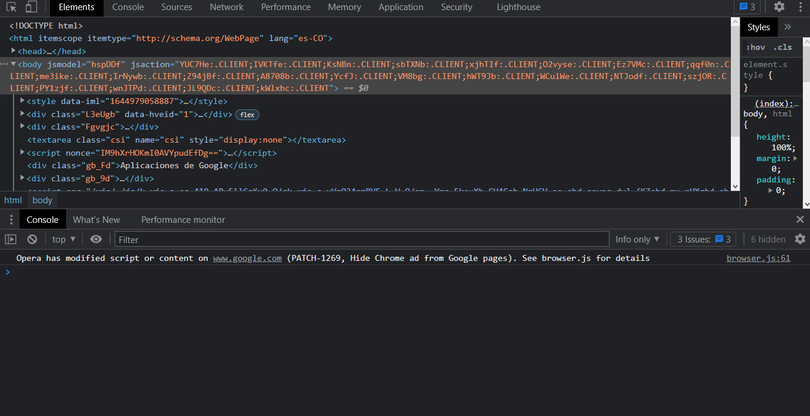
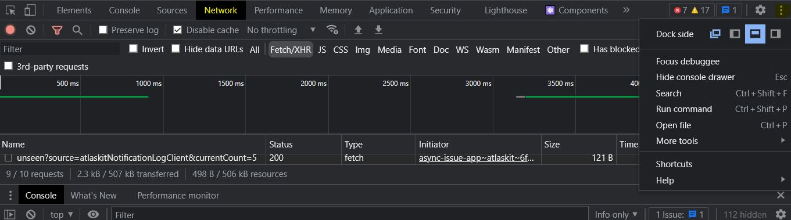
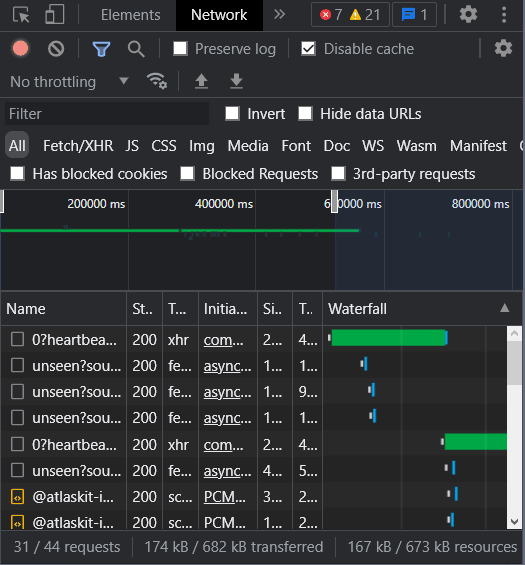
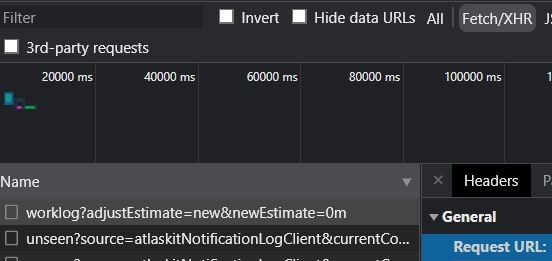
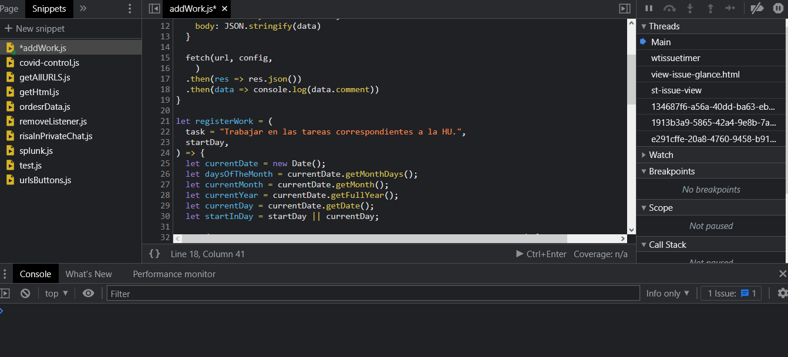

# SCRIPT PARA REGISTRAR TRABAJO EN JIRA

Con el ánimo de automatizar el registro de varios días de trabajo por adelantado he creado este script que se encargará de crear tantos registros como días laborables tiene el mes desde el día en el que se corra el script hasta el último día del mes usando un mensaje por defecto para describir las actividades diarias. 

Este script se debe correr desde la página de registros de trabajo de Jira.

## INSTRUCCIONES DE USO

### Creando un snippet

La manera más eficiente de utilizar el script es creando un snippet, que es un archivo que contiene una secuencia de instrucciones JS que se puede ejecutar cuantas veces sea necesario. Para ello, debes acceder a las herramientas de desarrollo de tu navegador, o ***dev tools***. Usando la combinación de teclas `Crtl + Shift + I` o pulsando `clic derecho + inspeccionar` se abrirá una ventana en el lateral izquierdo. En lo personal me gusta que las herramientas de desarrollo estén en una ventana aparte para poder trabajar mejor.



Para desplegar la consola inferior que se ve en el gif anterior puedes presionar la tecla `Esc`. Ahora es momento de crear el snippet. Los snippets se almacenarán en tu ordenador, por lo que podrás ejecutarlos cuantas veces sean necesarios. Para ello debes ir al panel de snippets y crear uno nuevo.



Si es tu primer snippet, solo te debería salir el que acabas de crear. Ahora debes agregar el siguiente código. 

```jsx
let sendWork = data => {
  const url = '' // La URL de la petición a realizar
  const config = {
    method: 'POST', 
    cache: 'no-cache', 
    credentials: 'same-origin', 
    headers: {
      'Content-Type': 'application/json'
    },
    redirect: 'follow', 
    referrerPolicy: 'no-referrer', 
    body: JSON.stringify(data) 
  }

  fetch(url, config,
    )
  .then(res => res.json())
  .then(data => console.log(data))
}

let registerJob = (
  task = 'Trabajar en las tareas correspondientes a la HU.',
  startDay,
) => {
  const currentDate = new Date()
  const currentMonth = currentDate.getMonth()
  const currentYear = currentDate.getFullYear()
  const currentDay = currentDate.getDate()
  const daysOfTheMonth = new Date(currentYear, currentMonth + 1, 0).getDate()
  const startInDay = startDay || currentDay

  for (let monthDay = startInDay; monthDay <= daysOfTheMonth; monthDay++) {
    const day = (monthDay % 7) + 1;
    if (day <= 5 && day >= 1) {
      const timeSpent = day == 5 ? "480m" : "540m";
      const month = currentMonth < 9 ? `0${currentMonth + 1}`: `${currentMonth + 1}`
      const started = `${currentYear}-${month}-${monthDay}T07:00:00.000-0500`
      const data = {
        timeSpent,
        comment: {
          version: 1,
          type: "doc",
          content: [
            {
              type: "paragraph",
              content: [
                {
                  type: "text",
                  text: task,
                },
              ],
            },
          ],
        },
        started,
      };
      sendWork(data)
    }
  }
};
```

- ⚠ Aclaración
    - Para ejecutar el script debemos ejecutar la función en consola `registerJob()`
    - Normalmente el código agregará registros de trabajo desde el día en el que se ejecuta el script hasta el último día del mes con una descripción por defecto. Si quiere modificar este comportamiento, puedes agregar los dos parámetros a la función `registerJob` .
- 📟 Parámetros de la función `registerJob`
    
    La función `registerJob` recibe dos parámetros, los cuales son opcionales.
    
    | Parámetro | Tipo | Descripción | Valor por defecto |
    | --- | --- | --- | --- |
    | Task | string | Este mensaje saldrá en cada registro de trabajo | 'Trabajar en las tareas correspondientes a la HU.’ |
    | startDay | number [1, último día del mes] | Día inicial de referencia. El script iniciará a agregar registros a partir de este día | undefined |

El snippet se ejecutará cuando uses la combinación de teclas `Ctrl + Enter` o cuando presiones sobre el recuadro ▶. Luego de eso podrás invocar la función `registerJob()` (para más info revisa la aclaración).

### Antes de invocar la función `registerJob()`

Si es la primera vez que vas correr el script, deberás configurar la url, que es la constante que le indicará al script a que dirección debe hacer el request para agregar los registros de trabajo. Este dato se debe agregar en la función `sendWork` , en la línea 2 del script. 

Para ello ingresa a la página de registro de trabajo y abre las ***dev tools*** y ve a la pestaña de network o red. Si no tienes un segundo monitor, para este caso es probable que te sea más cómodo dejar las ***dev tools*** en el lateral o en la parte inferior del navegador.  Recuerda que puedes configurar esto presionando los tres puntos del lateral superior derecho.



Es importante que abras la pestaña network antes de continuar. Esto le indicará al navegador que debe registrar las peticiones que se ejecuten hacía cualquier destino.  Ahora deberás crear un registro de trabajo. Cuando presiones el botón Guardar, se emitiría una request a un servidor de atlassian, y el destino de esta será la url que necesitamos.

> Tip: para que no tengas que buscar en medio de muchas request, usa el filtro Fetch/XHR y elimina el registro de las request existentes con el 🚫 tal y como se muestra a continuación.
> 



La url se encuentra en la pestaña **Headers** y es la **Request URL**. Cópiala y pégala en el snippet.



### ¡A registrar el trabajo!

El proceso anterior solo se debe hacer una vez. Como los snippets quedan almacenados en tu navegador, no será necesario buscar la url de nuevo, salvo que cambies de proyecto y debas registrar tu trabajo en otra página. Recuerda que este script lo debes correr en la página en la que normalmente registras el trabajo.

Luego de abrir la página en donde registras el trabajo normalmente, abrir las ***dev tools,*** crear el snippet y obtener la **Request URL** puedes ejecutar el script e invocar la función `registerJob()`

Como yo ya hice los registros del mes y no quiero tener que eliminar varios registros, pasaré como segundo parámetro el valor equivalente al último, pero tú no deberías hacer esto. Si quieres entender qué significa cada parámetro puedes revisar en “Parámetros”, al inicio de la documentación.



En lugar del último undefined que se ve en el gif, te saldrá la respuesta del servicio de atlassian que incluye la data del autor, el comentario, la fecha de creación, entre otra data que indica que todo ha salido correctamente.  

Y listo! Eso es todo. La primera vez puede que sea un poquito extenso, pero tan pronto como tengas implementado el snippet, básicamente el registro se hará solo.

Si tienes que registrar trabajo en más de una url o tienes un requerimiento específico, crea un [issue](https://github.com/luisforerop/script-to-register-job/issues) y agregaré el script correspondiente en el repo de [github](https://github.com/luisforerop/script-to-register-job).